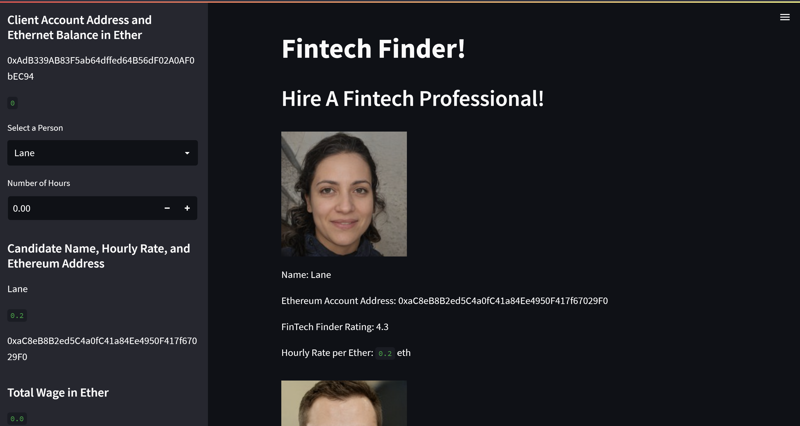

# Ethereum_Payments_Processor

In this code I create an application for hiring and paying fintech professionals directly with Eth.

---

## Technologies

This code was written on Windows 11 running python 3.8.13. It also uses Streamlit (Version 1.13.0) and Ganache (Version 2.5.4).

---

## Installation Guide

Streamlit can be installed with pip install, for Ganache download it from this page: https://trufflesuite.com/ganache/

---

## Usage

To interact with this code you must first install Ganache and Streamlit. Open Ganache and copy your "seed phrase" displayed in the upper left hand portion of the screen. Paste it into a .env with and assign it to a variable "MNEMONIC". Leave Ganache running. 

Open your command line and navigate to this repository. Type "streamlit run fintech_finder.py". Streamlit should open the app in your default browser and you should be greeted with this screen:

You can use the sidebar to select a hypothetical fintech professional, the number of hours you'd like to hire them for, and then send a transaction to their Eth address. You should be able to see the amount of eth in your wallet going down.

---

## Contributors

Garrett Hernandez -gtkhhz@gmail.com

---

## License

This is free and unencumbered software released into the public domain.

Anyone is free to copy, modify, publish, use, compile, sell, or
distribute this software, either in source code form or as a compiled
binary, for any purpose, commercial or non-commercial, and by any
means.

In jurisdictions that recognize copyright laws, the author or authors
of this software dedicate any and all copyright interest in the
software to the public domain. We make this dedication for the benefit
of the public at large and to the detriment of our heirs and
successors. We intend this dedication to be an overt act of
relinquishment in perpetuity of all present and future rights to this
software under copyright law.

THE SOFTWARE IS PROVIDED "AS IS", WITHOUT WARRANTY OF ANY KIND,
EXPRESS OR IMPLIED, INCLUDING BUT NOT LIMITED TO THE WARRANTIES OF
MERCHANTABILITY, FITNESS FOR A PARTICULAR PURPOSE AND NONINFRINGEMENT.
IN NO EVENT SHALL THE AUTHORS BE LIABLE FOR ANY CLAIM, DAMAGES OR
OTHER LIABILITY, WHETHER IN AN ACTION OF CONTRACT, TORT OR OTHERWISE,
ARISING FROM, OUT OF OR IN CONNECTION WITH THE SOFTWARE OR THE USE OR
OTHER DEALINGS IN THE SOFTWARE.

For more information, please refer to <https://unlicense.org>
